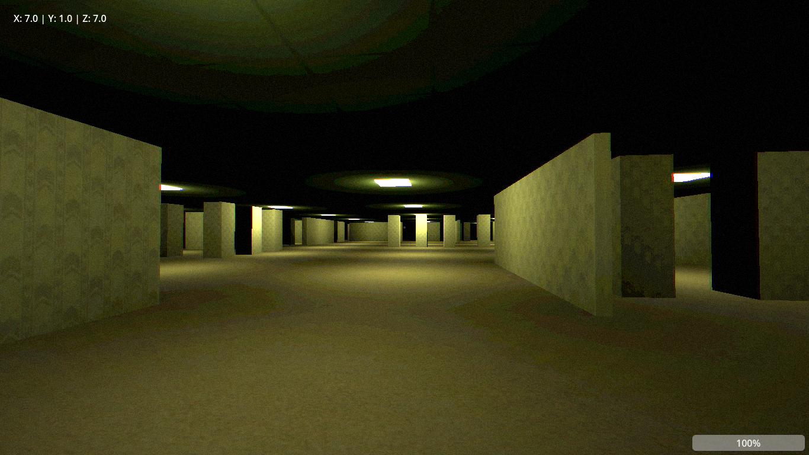
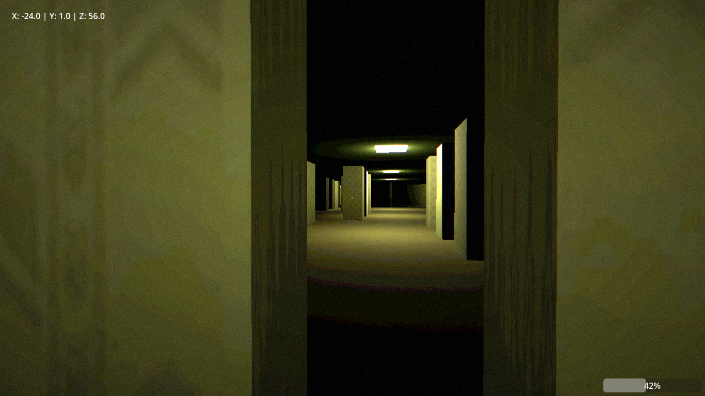
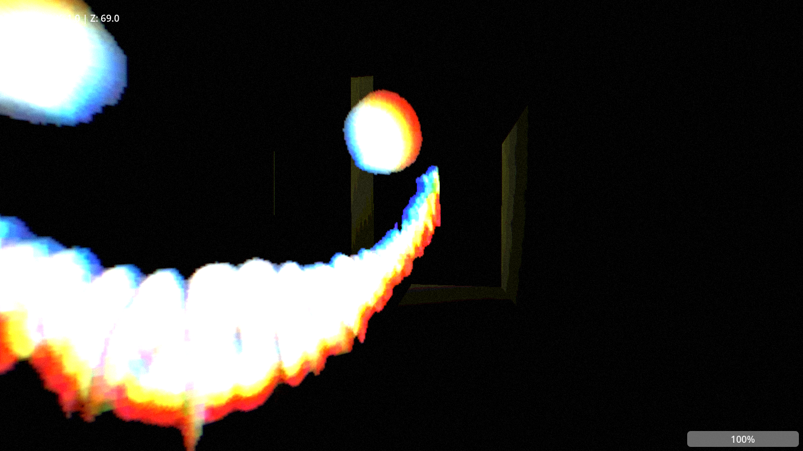

# Die Hinterzimmer
"Die Hinterzimmer" ist ein 3D-Horror-Spiel, bei dem Spieler versucht, die endlosen prozedual generierten Räumen zu verlassen. Auf der Suche nach einem Ausgang begegnen ihm besonders in dunklen Bereichen des Gebäudes feindliche Gestalten, welche versuchen ihn zu eleminieren. Daher gilt es diese zu umgehen. Sobald der Spieler sechshundert bis eintausend Längenmaße zurückgelegt hat, wird er einen Ausgang finden können.

## Aufnahmen

## Steuerung des Spielers
* `W` - Vorwärts gehen
* `S` - Rückwärts gehen
* `A` - Nach links bewegen
* `D` - NAch rechts bewegen
* `Umschalttaste` - Rennen
* `E` - Mit Objekt(en) interagieren

## Technisches
Das Spiel wurde mit der quelloffenen Game Engine Godot programmiert. Komplexe 3D-Modelle wurden mit der Grafiksoftware Blender erstellt.

## Copyright
Copyright &copy; 2025-2026 Felix Wrba. Alle Rechte vorbehalten.
